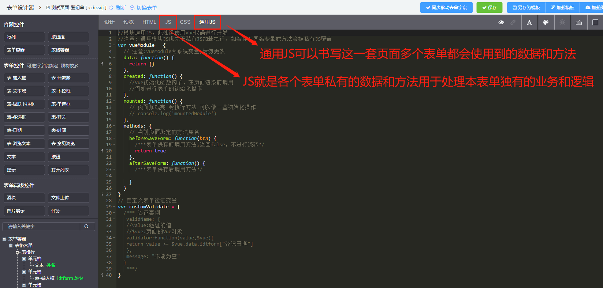

# 作用域
## 概念
  1. 变量它们储存在哪里？程序需要时如何找到它们？
  2. 这些问题说明需要一套设计良好的规则来存储变量，并且之后可以方便地找到这些变量。这套规则被称为作用域。
  3. 重点在于存储 & 查询

## 存储（变量赋值）
  + 变量的赋值操作会执行两个动作。
    1. 编译器会在当前作用域中声明一个变量（如果之前没有声明过）
    2. 运行时引擎会在作用域中查找该变量，如果能够找到就会对它赋值。
``` js 
  // 例如 
  // 编译器 ----> 作用域 声明变量a
  // 引擎 ----> 作用域 为a赋值2
  var a = 2
```
## LHS查询和RHS查询
  个人理解为LHS是变量赋值，RHS是查找变量

## 嵌套作用域链
  遍历嵌套作用域链的规则很简单：引擎从当前的执行作用域开始查找变量，如果找不到，就向上一级继续查找。当抵达最外层的全局作用域时，无论找到还是没找到，查找过程都会停止。
    

## 函数作用域
  1. 函数作用域的含义是指属于这个函数的全部变量都可以在整个函数的范围内使用及复用（事实上在嵌套的作用域中也可以使用）。
  2. 这种设计方案是非常有用的，能充分利用JavaScript变量可以根据需要改变值类型的“动态”特性。

## 最小授权或最小暴露原则
  1. 指在软件设计中，应该最小限度地暴露必要内容，而将其他内容都“隐藏”起来，比如某个模块或对象的API设计。 
  2. “隐藏”作用域中的变量和函数所带来的另一个好处，是可以避免同名标识符之间的冲突，两个标识符可能具有相同的名字但用途却不一样，无意间可能造成命名冲突。冲突会导致变量的值被意外覆盖。
  
## 函数声明和函数表达式
  区分函数声明和表达式最简单的方法是看function关键字出现在声明中的位置（不仅仅是一行代码，而是整个声明中的位置）。如果function是声明中的第一个词，那么就是一个函数声明，否则就是一个函数表达式。
  
## 立即执行函数表达式 (IIFE)
  语法：(function foo(){ .. })()或者(function(){ .. }())。第一个()将函数变成表达式，第二个()执行了这个函数
``` js 
  // 第一种语法
  var a = 2
  (function foo() {
    var a = 3
    console.log(a) // 3
  })()
  console.log(a) // 2

  // 第二种语法
  var b = 2
  (function IIFE() {
    var b = 3
    console.log(b) // 3
  }())
  console.log(b) // 2

  // 进阶用法
  var c = 2
  (function(global) {
    var c = 3
    console.log(c) // 3
    console.log(global.c) // 2
  })(window)
  console.log(c) // 2
```