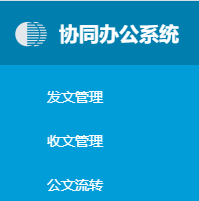

# API
## 全局配置
**sysconfig.js**为系统的全局配置文件，该文件将由系统自动加载。
### servicePath
* 类型：string
* 默认值：无
* 用法：<br/>
 设置项目的服务地址
``` js
 var servicePath = '/idtAppServiceV6'
```

### appkey
* 类型：string
* 默认值：无
* 用法：<br/>
 设置项目健值，解决同源本地存储问题
 ``` js
 var appkey = 'idtwork'
 ```
### systemTitle
* 类型：string
* 默认值：无
* 用法：<br/>
 设置项目的Title名称
 ``` js
 var systemTitle = 'xxx系统'
 ```
 ### systemTopTitle
* 类型：Object
* 默认值：{}
* 用法：<br/>
 设置首页头部标题名称
 
 ``` js
var systemTopTitle = {
  short: 'xxx系统', // 用于默认布局模式下显示精简标题
  lang: 'xxx系统' // 用于显示完整标题
  sub: 'XX子系统' // 用于显示副标题
}
 ```
   

### idtAppConfig
---
更改系统默认配置及系统设置项显示控制
#### idtAppConfig.sysConfig
* 类型：`Object`

* 默认值：`{}`
* 用法：  

  可根据业务需求和应用场景更改系统默认设置项，设置后系统初始化将以此为默认设置项进行初始化。

  你可以更改以下默认设置项：  
    * `layout`： 首页布局，
    
      可选值为：
      | 首页类型 | 名称 |
      |---------- |-------- |
      |basic_1|流行简约（一）| 
      |basic_2|流行简约（二）|
      |tradition_1|传统办公（一）|
      |tradition_2|传统办公（二）|
      |classic_1|经典办公（一）|
      |classic_2|经典办公（二）|
      |web_1|职能门户（一）|
      |web_2|职能门户（二）|
    * `multiTab`： 多选框卡模式，可选值为 `true`（开启）、 `false`（关闭）
    * `grayMode`： 灰度模式，可选值为 `true`（开启）、 `false`（关闭）
    * `colorWeak`： 色弱辅助模式，可选值为 `true`（开启）、 `false`（关闭） 
  ::: tip 注意
  默认主题色由于需要在打包编辑之前设置，故不支持更改
  :::

#### idtAppConfig.layoutConfig
* 类型：`Array`

* 默认值：`[]`
* 用法：  

  可根据业务需求和应用场景更改系统首页设置项。
  
  ::: tip 注意
  此配置项根据id匹配系统默认配置项，因此id必须为系统默认首页类型（参见sysconfig中layout）；此处使用数组可以进行顺序调整，可通过修改title属性改变显示文字；默认前两个为系统推荐布局。
  :::
  系统首页设置项说明：
  * `id`： 布局类型唯一标识，不可更改
  * `icon`： 布局缩略图；资源路径为project/项目路径/images/layout/
  * `title`： 布局显示名称
  * `sysConfig`： 相关默认设置
    * `layoutType`： 布局类型，布局类型：default（默认简约）、tradition（传统）、classic(经典)，非特殊情况无需修改
    * `layoutMode`： 布局模式，布局模式basic：基础布局，mini：极简布局（无导航和头部，适用大屏或个性化场景）
    
    * `primaryColor`： 主题色，系统默认主题色选项：红色`#c40403`，橙色`#ff5500`，蓝色`#07a1e1`，绿色`#01a293`，推荐使用系统默认主题色，也可以使用自定义颜色
    * `navTheme`： 导航风格：暗色风格`dark`、主题色风格`themeColor`
    * `menuMode`： 导航模式：侧边栏模式`sidemenu`、顶部导航模式`topmenu`、分组模式`groupmenu`
    * `headerMode`： header模式：混合模式`mix`（header包含menu）、独立顶部模式`top`（header不包含menu）
    * `headerMenuIcon`： 顶部导航图标模式normal(正常)、large(大图标)
    * `titleType`： 系统标题类型：短标题`short`、长标题`lang`，此处根据systemTopTitle中设置内容显示
    * `titleStyle`： 标题（包含logo）样式
      * `logo`： 可设置logo私有样式，一般通过`logo: { 'height': 'XXpx' }` 调整logo大小
      * `mainTitle`： 可设置主标题私有样式
      * `subTitle`： 可设置子标题私有样式
      * `sDeptTitleStyle`： 可设置单位名称私有样式
    * `logo`： logo图标，资源路径为project/项目路径/logo/；系统默认使用三个logo图片：logo.png(正常浅色图标)、logo_d.png（深色图标）、logo_large.png（大图标，简约二、门户二使用）
    * `wallpaper`： 壁纸类型，系统默认6种壁纸：`wallpaper1`、`wallpaper2`、`wallpaper3`、`wallpaper4`、`wallpaper5`、`wallpaper6`；资源路径为project/项目路径/images/wallpaper/
    * `backgroundImage`： 背景图设置，支持header、sider和siderBottom三个位置设置背景；资源路径为project/项目路径/images/bg/
      * `header`： 顶部背景图
      * `sider`： 侧边栏导航背景图
      * `siderBottom`： 侧边栏导航底部背景图
  系统内置布局设置：

  ``` js
  const defaultLayout = [
    {
      id: 'basic_1',
      icon: 'basic_1.jpg',
      title: '流行简约(一)',
      sysConfig: {
        layoutType: 'default',
        primaryColor: '#07a1e1',
        navTheme: 'dark',
        menuMode: 'sidemenu',
        headerMode: 'mix',
        headerMenuIcon: 'normal',
        titleType: 'short',
        logo: 'logo.png',
        wallpaper: '',
        backgroundImage: {},
        titleStyle: {}
      }
    },
    {
      id: 'basic_2',
      icon: 'basic_2.jpg',
      title: '流行简约(二)',
      sysConfig: {
        layoutType: 'default',
        primaryColor: '#07a1e1',
        navTheme: 'dark',
        menuMode: 'sidemenu',
        headerMode: 'mix',
        headerMenuIcon: 'normal',
        titleType: 'lang',
        logo: 'logo_large.png',
        wallpaper: '',
        backgroundImage: {},
        titleStyle: {}
      }
    },
    {
      id: 'tradition_1',
      icon: 'tradition_1.jpg',
      title: '传统办公（一）',
      sysConfig: {
        layoutType: 'tradition',
        primaryColor: '#07a1e1',
        navTheme: 'themeColor',
        menuMode: 'sidemenu',
        headerMode: 'mix',
        headerMenuIcon: 'normal',
        titleType: 'lang',
        logo: 'logo.png',
        wallpaper: '',
        backgroundImage: {},
        titleStyle: {}
      }
    },
    {
      id: 'tradition_2',
      icon: 'tradition_2.jpg',
      title: '传统办公（二）',
      sysConfig: {
        layoutType: 'tradition_web',
        primaryColor: '#07a1e1',
        navTheme: 'themeColor',
        menuMode: 'groupmenu',
        headerMode: 'mix',
        headerMenuIcon: 'normal',
        titleType: 'lang',
        logo: 'logo.png',
        wallpaper: '',
        backgroundImage: {},
        titleStyle: {}
      }
    },
    {
      id: 'classic_1',
      icon: 'classic_1.jpg',
      title: '经典办公(一)',
      sysConfig: {
        layoutType: 'classic',
        primaryColor: '#c40403',
        navTheme: 'themeColor',
        menuMode: 'topmenu',
        headerMode: 'mix',
        headerMenuIcon: 'normal',
        titleType: 'lang',
        logo: 'logo.png',
        wallpaper: '',
        backgroundImage: {},
        titleStyle: {}
      }
    },
    {
      id: 'classic_2',
      icon: 'classic_2.jpg',
      title: '经典办公(二)',
      sysConfig: {
        layoutType: 'classic',
        primaryColor: '#07a1e1',
        navTheme: 'dark',
        menuMode: 'topmenu',
        headerMode: 'top',
        headerMenuIcon: 'normal',
        titleType: 'lang',
        logo: 'logo_d.png',
        wallpaper: '',
        backgroundImage: {},
        titleStyle: {}
      }
    },
    {
      id: 'web_1',
      icon: 'web_1.jpg',
      title: '职能门户（一）',
      sysConfig: {
        layoutType: 'classic',
        primaryColor: '#01a293',
        navTheme: 'themeColor',
        menuMode: 'topmenu',
        headerMode: 'top',
        headerMenuIcon: 'normal',
        titleType: 'lang',
        logo: 'logo_d.png',
        wallpaper: 'wallpaper1',
        backgroundImage: {},
        titleStyle: {}
      }
    },
    {
      id: 'web_2',
      icon: 'web_2.jpg',
      title: '职能门户（二）',
      sysConfig: {
        layoutType: 'classic',
        primaryColor: '#ff5500',
        navTheme: 'themeColor',
        menuMode: 'topmenu',
        headerMode: 'top',
        headerMenuIcon: 'normal',
        titleType: 'lang',
        logo: 'logo_large.png',
        wallpaper: 'wallpaper2',
        backgroundImage: {},
        titleStyle: {}
      }
    }
  ]
  ```

#### idtAppConfig.menuConfig
* 类型：`Object`

* 默认值：`{}`
* 用法：  

  配置系统功能按钮是否显示

  你可以更改以下默认设置项：

    * `firstPageBtn`： 操作集中首页按钮是否显示，可选值为 `true`（显示）、 `false`（隐藏），默认：`true`
    * `searchBtn`： 首页顶部搜索是否显示，可选值为 `true`（显示）、 `false`（隐藏），默认：`true`

  
  扩展设置项：

    * `id` : 通过系统自定义按钮的id控制按钮是否显示，可选值为 `true`（显示）、 `false`（隐藏），默认：`true`

#### idtAppConfig.settingVisible
* 类型：`Object`

* 默认值：`{}`
* 用法：  
  配置系统预设设置项是否显示

  你可以更改是否显示以下设置项：
    * `layout`： 布局风格，可选值为 `true`（显示）、 `false`（隐藏）
    * `navTheme`： 导航颜色，可选值为 `true`（显示）、 `false`（隐藏）
    * `primaryColor`： 主题色，可选值为 `true`（显示）、 `false`（隐藏）
    * `multiTab`： 多选框卡，可选值为 `true`（显示）、 `false`（隐藏）
    * `grayMode`： 灰度模式，可选值为 `true`（显示）、 `false`（隐藏）
    * `colorWeak`： 色弱辅助模式，可选值为 `true`（显示）、 `false`（隐藏）   
#### idtAppConfig.svgLibrary
* 类型：`Array`

* 默认值：`[]`
* 用法：  
  配置系统使用的svg库

* 参考配置：
 ``` js
 var idtAppConfig = {
  sysConfig: {
    layout: 'basic_1', // 首页布局
    multiTab: true, // 多选框卡
    grayMode: false, // 灰度模式
    colorWeak: false // 色弱模式
  },
  layoutConfig: [
    // { id: 'basic_1', title: '风格一'},
    // { id: 'tradition_1', title: '风格二'},
  ], // 首页设置自定义，如果为空数组，则使用系统默认设置
  menuConfig: {
    firstPageBtn: false, // 操作集中首页按钮是否显示
    searchBtn: false // 首页顶部搜索是否显示
    // 以下为项目自定义按钮控制，key为按钮id
    signIn: false, // 首页顶部签到是否显示
    signOut: false, // 首页顶部签退是否显示
  },
  settingVisible: {
    // 配置设置项是否显示
    layout: true,
    navTheme: true,
    primaryColor: true,
    grayMode: true,
    colorWeak: true,
    multiTab: true,
  },
  svgLibrary: ['oa']
};
 ```
 #### idtAppConfig.remindIntervalTime
* 类型：`String`

* 默认值：`5`
* 时间单位：`秒`
* 用法：  
  系统推送信息（右下角提示框）请求刷新时间间隔
### serviceApi
* 类型：`Object`

* 默认值：`{}`
* 用法：  
  配置系统服务地址的定义
  ``` js
  var serviceApi ={
    getNowDate:{
        path:'/application/interfaces/public/getNowDate.jsp',
        desc:'获取服务器时间'
    }
  }
  ```
## 网络请求
### exeService
* 参数：
  + ` {Object} serviceOptions ` 
    + `{string} url` 服务地址
    + `{Object} data` 参数,可为空
    + `{string} type` 类型 `post{default}|get`
  + `{Function} successCallback` 成功回调，可为空
  + `{Function} failureCallback` 失败回调，可为空
* 用法:<br/>
  调用网络服务的异步接口，**推荐**使用该异步接口进行开发
  1. 请求参数可为空
``` js {6-10}
var serviceOptions = {
  url: IDTApi.oApp_getAllOperate.path, //必选：访问请求地址 
  type: 'post', //可选：type值可为post或get,默认使用post
  data: {} //可选：api需要提交的参数值(健值对)，默认为{}
}
IDTAPI.exeService(serviceOptions, function (res) {
  //成功处理,该函数可不写，系统将弹出成功提示消息
}, function (err) {
  //错误处理，该函数可不写，系统将弹出错误提示消息
});
```
  2. 请求参数不为空
``` js {8-10}
/**示例1：获取子操作集 */
var serviceOptions = {
  url: IDTApi.oApp_getAllOperateById.path,
  data: {
    operatorId: operateId
  }
}
IDTAPI.exeService(serviceOptions, function (res) {
  console.log(res.data);
});
```
3. 自定义SQL调用
``` js
var data = {
  script: 'getLmTreeByQx',
  args: [userid],
  keys: [],
  replaceMap: {
    developer: IDTAPI.USER.getUserinfo().developer
  }
}
var serviceOptions = {
  url: window.IDTApi.control_getList.path,
  data: data
}
IDTAPI.exeService(serviceOptions, function (res) {
  console.log(res.data);
});
```
### syncExeService
* 参数：
  + ` {Object} serviceOptions ` 
    + `{string} url` 服务地址
    + `{Object} data` 参数,可为空
    + `{string} type` 类型 `post{default}|get`
  + `{Function} successCallback` 成功回调，可为空
  + `{Function} failureCallback` 失败回调，可为空
* 用法:<br/>
  调用网络服务的同步接口，**强烈不推荐**使用该同步接口进行开发<br/>
  开发实例请参考上面 **exeService**
### exeFileService
* 参数：
  + ` {string} url ` 
  + `{FormData} postData` 带附件请求正文
* 用法:<br/>
  附件上传的异步接口

``` js
  var postData = new FormData();
  var postData = new FormData();
  postData.append("UUID", "");
  postData.append("ATTACH_ID", uuid);
  postData.append("FIELDNAME","fj");
  postData.append("tableId", tableId);
  postData.append("FILENAME", encode64(fileObj.name));
  var fileObj = e.target.files["0"];
  postData.append("file", fileObj);
  window.IDTAPI.exeFileService(
  window.IDTApi.oApp_balanceUploadFile.path,
   postData).then(function(res) {
      if (res.status == "success") {
        self.getBlobList(name);
      } else {
        IDTAPI.info({ content: res.message });
      }
    })
```

## 用户信息及本地存储
### getToken()
* 参数：
  无
* 用法:
  获取用户票据(每次访问服务时，该票据将自动更新)
``` js
  var token = IDTAPI.USER.getToken();
```
### getUserinfo()
* 参数：
  无
* 用法:
  获取用户信息 
``` js
  var userinfo = IDTAPI.USER.getUserinfo();
```
### setItem(key, value)
* 参数：
  + `{string} key ` 键值
  + `{string} value` 储存值
* 用法:
  在本地存储设置值
``` js
   IDTAPI.USER.setItem('userName', 'zs');
```
### getItem(key)
* 参数：
  + `{string} key ` 键值
* 用法:
  根据键值获取本地储存的相应值
``` js
   IDTAPI.USER.getItem('userName');
```
### clear()
* 参数：
  无
* 用法:
  清除本地储存的所有值
``` js
   IDTAPI.USER.clear();
```
::: warning 注意
该方法会清除本地用户票据信息，系统将跳转到登录页面。
:::
## 提示对话框
### alert(info,fn)
* 参数：
  + ` {object} info ` 消息对象
    + `{string} title` 标题
    + `{string} content` 消息内容，当useHtml为true,可以使用html格式
    + `{boolean} useHtml`  是否支持html格式显示 `false{default} | true`
    + `{string} type`  显示图标类型 `warning {default} | success | info | error`
  + `{function} callback`  确定后回调函数
* 用法:<br/>
  消息提示对话框
  ``` js
  IDTAPI.alert({title: '提示', content: '测试内容'})
  IDTAPI.alert({title: '提示', useHtml:true, content: '测试内容<br/>换行测试'})
  IDTAPI.alert({title: '提示', useHtml:true, content: '测试内容<br/>换行测试'}
    ,function(){
      console.log('提示完成处理方法')
    })
  ```
### confirm(info, yes_Callback, no_Callback)
* 参数：
  + ` {object} info ` 消息对象
    + `{string} title` 标题
    + `{string} content` 消息内容，当useHtml为true,可以使用html格式
    + `{boolean} useHtml`  是否支持html格式显示 `false{default} | true`
    + `{string} yesText` 自定义确定文本 `{default} 确定`
    + `{string} noText` 自定义取消文本 `{default} 取消`
    + `{string} type`  显示图标类型 `warning {default} | success | info | error`
  + `{function} yes_Callback`  确定回调函数
  + `{function} no_Callback`   取消回调函数
* 用法:<br/>
  消息提示对话框
``` js
 IDTAPI.confirm({title: '系统提示', useHtml:true,
  content: '确定需要删除吗？'},
  function(){
    console.log('点击确定回调处理')
  },function(){
    console.log('点击取消回调处理')
  })
```
### info
* 参数：
  + ` {object} info ` 消息对象
    + `{string} content` 消息内容
    + `{string} type` 显示图标类型 `warning {default} | success | info | error`
* 用法<br/>
  消息提示
``` js
  IDTAPI.info({content: '操作成功',type: 'success'})
```
### notify
* 参数：
  + ` {object} info ` 消息对象
    + `{string} title` 标题
    + `{string} content` 通知内容
    + `{string} type` 显示图标类型 `warning {default} | success | info | error`
    + `{boolean} useHtml`  是否支持html格式显示 `false{default} | true`
    + `{string} position`  通知的显示位置  `top-right{default}|top-left|bottom-right|bottom-left`
* 用法<br/>
  消息通知
``` js
  IDTAPI.notify({content: '操作成功',type: 'success'})
```
## 原生方法
### Date.format(format)
* 参数：
  + ` {String} format `
* 用法:<br/>
  进日期进行格式化

``` js {2}
var date = new Date("2020-06-06");
console.log(date.format('yyyy-MM-dd HH:mm:ss')) // 2020-06-06 08:00:00
```
### Date.pattern
* 参数：
  + `{String} fmt`
* 用法:<br/>
  进行日期格式化（星期,和季度）
``` js {2-3}
var date= new Date("2020-06-07");
console.log(date.pattern('E')) // 日  // 区分大小写
console.log(date.pattern('q')) // 2 
```
### Date.addDays
* 参数：
  + `{Number} d`
* 用法：<br/>
  增加当前天数
``` js {2}
var date = new Date("2020-06-06")
date.addDays(1)
console.log(date) // Sun Jun 07 2020 08:00:00 GMT+0800 (中国标准时间)
```
### Date.addWeeks
* 参数：
  + `{Number} w`
* 用法：<br/>
  增加当前星期
``` js {2}
var date = new Date("2020-06-06")
date.addWeeks(2)
console.log(date) // Sat Jun 20 2020 08:00:00 GMT+0800 (中国标准时间)
```
### Date.addMonths
* 参数：
  + `{Number} m`
* 用法：<br/>
  增加当前月份
``` js {2}
var date = new Date("2020-06-06")
date.addMonths(5)
console.log(date) // Fri Nov 06 2020 08:00:00 GMT+0800 (中国标准时间)
```
### Date.addYears
* 参数：
  + `{Number} y`
* 用法：<br/>
  增加当前年份
``` js {2}
var date = new Date("2020-06-06")
date.addYears(6)
console.log(date) // Sat Jun 06 2026 08:00:00 GMT+0800 (中国标准时间)
```
### String.ellipse
* 参数：
  + `{Number} maxLength`
* 用法<br/>
  设置字符串最大长度（超出显示 ... ）（不改变原来的字符串）
``` js {2}
var str="技术资料"
console.log(str.ellipse(5))
console.log(str)
```
### String.trim
* 用法<br/>
  去除首尾空格（不改变原来的字符串）
``` js {2}
var str="  技术资料  "
console.log(str.trim())
console.log(str)
```
### Array.unique
* 用法<br/>
  数组的去重（改变原来的数组）
``` js {2}
var arr = [1,2,3,4,5,6,7,8,9,9,1,5,6,6,3,2,5,4,6,5,4,5]
console.log(arr.unique()) //["1", "2", "3", "4", "5", "6", "7", "8", "9"]
console.log(arr) // ["1", "2", "3", "4", "5", "6", "7", "8", "9"]
```
## 工具类
工具类方法放在window下的IDTAPI.Tools下。调用时使用IDTAPI.Tools.方法名进行调用
### downloadFile(url)
* 参数：
  +  ` {String} url ` 下载的url地址
::: warning 注意
url不用带 **票据** (**authToken**) 信息
:::
* 用法:<br/>
> 该下载函数，会自动创建虚拟iframe并且加上用户票据进行文件的下载。
``` js 
IDTAPI.Tools.downloadFile(url)
```

### getNowDate(dateFmt)
* 参数：
  + `{string} dateFmt ` 日期格式
    + yyyy-MM-dd;
    + HH:mm:ss
    + yyyy-MM-dd HH:mm:ss
* 用法:
  根据当前服务器时间
``` js
   IDTAPI.Tools.getNowDate('yyyy-MM-dd HH:mm:ss');
```
### getTime(time,format)
 * 参数：
  + `{number} time ` 时间戳,可为空，为空时，为当前客户端时间
  +  `{boolean} format ` 格式化，默认'yyyy-mm-dd'
* 用法:
  获取Get请求的参数
``` js
   IDTAPI.Tools.queryString('name',true);
```
### queryString(name, isdecode)
 * 参数：
  + `{string} name ` 参数名称
  +  `{boolean} isdecode ` 是否需要中文解码,如果参数值有中文时，必须为true
* 用法:
  获取Get请求的参数
``` js
   IDTAPI.Tools.queryString('name',true);
```
### loadScript(url,callback)
* 参数：
  + ` {String} url ` 引入的文件路径
  + ` {function} callback ` 加载完文件的回调事件
  
* 用法：
> 在页面指定位置加载js文件，一般用于自定义页面中加载外部的js包。
``` js 
IDTAPI.Tools.loadScript('./cropper.js',function(){
  //需要执行的内容
  console.log('加载cropper.js文件成功!')
})
```

## 子页面全局变量
### idt_iframePageInfo
存储iframe子页面信息，主要用于子页面内获取当前页面信息，请勿手动修改

页面信息如下：

  * `id`：页面id

  * `pId`：父页面id
  * `data`：用户自定义数据对象
  * `mode`：页面模式， `template` 为模板模式
  * `operateId`：页面对应操作集id
  * `type`：页面类型
  * `uuid`：页面uuid
  * `openMode`：页面打开模式，`tab`：选项打开、`inner`：内部打开、`dialog`：弹窗打开
  * `active`: 当前页面激活状态（仅选项卡内页面有效）
``` js 
  console.log(window.idt_iframePageInfo)
  输出：{ 
    id: "firstPage"
    pId: ""
    data: ""
    mode: ""
    operateId: ""
    type: "firstPage"
    uuid: ""
    openMode: "tab"
    active: true
  }
  ```
## 全局主题色样式
### .el-primary-color
主题色color

### .el-primary-backgroundcolor
主题色backgroundcolor

### .el-primary-bordercolor
主题色bordercolor