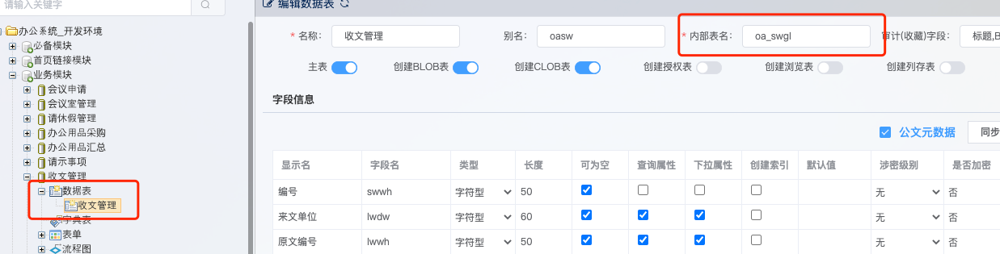
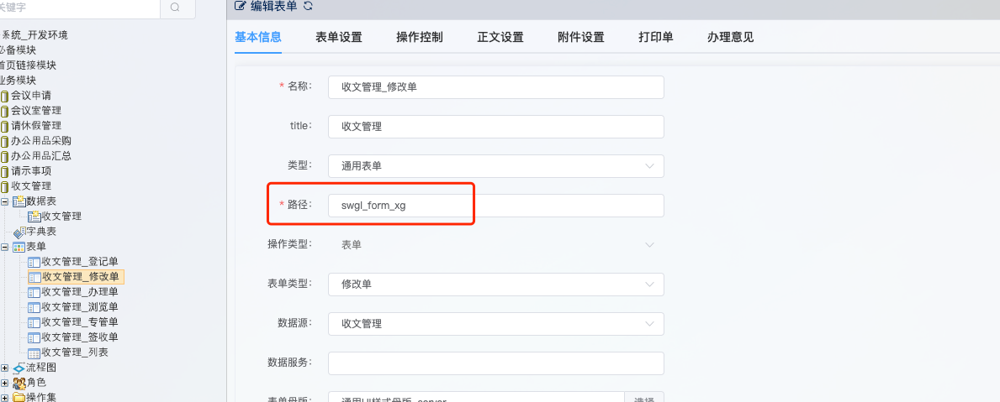
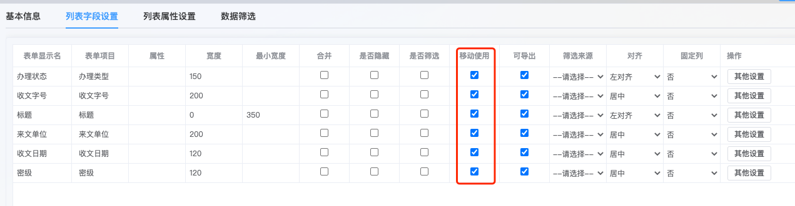
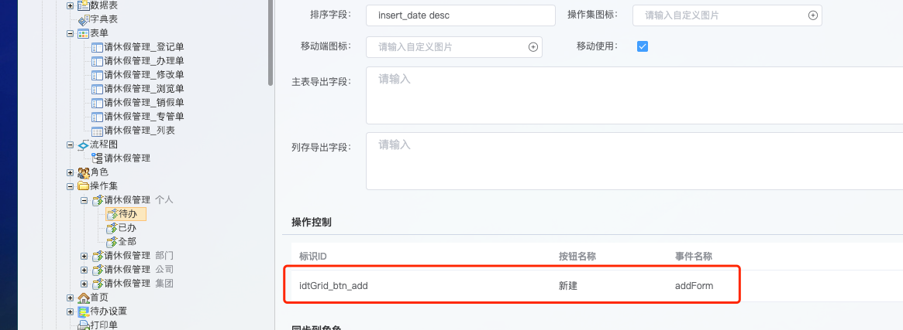

# 平台配置
## JSON目录
基础地址：
webapps/idtAppServiceV6/project/{项目名称}/templateApp/{对应模块表别名}/{表单配置模板名称}
* 模块对应表别名 是platform中的数据表中的主表的内部表名字段。如下图，收文管理为例

* 表单配置模板名称 是platform中表单配置中的路径字段。如下图，

## 表单配置与JSON配置的关系
### 列表
移动端显示的字段为列表配置中勾选了移动使用的字段。如下图，

字段的显示顺序以JSON中配置的keys的顺序为准，如果keys未配置，以platform中的表单配置顺序为准。

* 列表中【新增】按钮显示条件为JSON中的buttonGroup配置的按钮并且操作集中有配置新增按钮，操作集配置位置如下图

### 表单
移动端表单显示字段为表单字段配置中勾选了移动使用的字段。字段显示顺序以JSON中配置keys字段的顺序为准，如未配置keys字段，以表单配置字段顺序为准。
